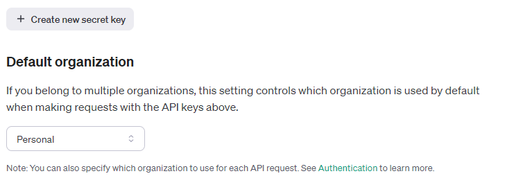

# Etap 1

Witam na warsztatach poświęconych Generative AI!
W tym etapie dowiemy się jak: 

- ustawić wektorową bazę danych
- wczytać dokument PDF
- podzielić dokument na mniejsze fragmenty
- przekształcić tekst na wektor
- zindeksować wektory w bazie danych
- przeszukać bazę danych

## Wprowadzenie i ustawiania początkowe

Na początku ustawmy bazę wektorową, tak żebyśmy mogli z niej korzystać w dalszej części warsztatów.

```python
from langchain.vectorstores.chroma import Chroma
from langchain.embeddings.openai import OpenAIEmbeddings
from langchain.document_loaders import PyPDFLoader

db = Chroma(embedding_function=OpenAIEmbeddings(), persist_directory="db")
```

Dużo się tutaj dzieje. Rozpakujmy to krok po kroku:

- używamy biblioteki `langchain`, zapewnia ona abstrakcję dla operacji na języku naturalnym. Dzięki temu w prosty sposób możemy połączyć różne bazy wektorowe, modele językowe i inne narzędzia do pracy z tekstem.
- `Chroma` to baza wektorowa, która pozwala na indeksowanie wektorów i ich przeszukiwanie. W tym przypadku używamy bazy wektorowej, która jest zapisywana na dysku. Dzięki temu nie musimy za każdym razem odpytywać modelu językowego, co jest w dłuższej mierze kosztowne.
- `OpenAIEmbeddings` to model językowy dostarczony przez OpenAI dostępny za pośrednictwem ich API. Służy
on do generowania wektorów dla słów i zdań, które będą zapisywane w bazie wektorowej.
- `PyPDFLoader` to klasa, która pozwala na wczytanie dokumentu PDF i podzielenie go na mniejsze fragmenty. W tym przypadku używamy jej do wczytania dokumentu PDF z artykułem.

Żebyśmy mogli używać platformy OpenAI, musimy mieć konto na ich stronie i stworzyć klucz dostępu do API. Możemy to zrobić na stronie https://platform.openai.com/api-keys.



Kopiujemy wyświetloną wartość i zapisujemy ją w pliku `.env` w głównym katalogu z warsztatami.

```bash
OPENAI_API_KEY=<twój-klucz>
```

Następnie możemy użyć biblioteki `dotenv` do wczytania klucza z pliku `.env`:

```python
import dotenv

dotenv.load_dotenv()
```

Teraz jesteśmy gotowi do korzystania z platformy OpenAI. Wygenerujmy embeddingi dla dwóch zdań (dwóch dokumentów) "Filemon to biały kot" i "Rex to czarny pies":

```python
embedding_function = OpenAIEmbeddings()
documents = [
    "Filemon to biały kot", 
    "Rex to czarny pies"
]

embeddings = embedding_function.embed_documents(documents)

for embedding in embeddings:
    print(f"Size: {len(embedding)}, ten first values: {embedding[:10]}")
```
Uruchom skrypt `python chapters/ch1/workshop.py` i zobacz co się stanie. A stało się to:
```
Size: 1536, ten first values: [-0.0007059573651396749, -0.0068613956714559535, -0.020827593740773958, -0.013124146545522233, -0.03336624948806383, 0.021393346089690245, -0.02189331354165976, -0.012821534715715554, -0.006986387534448332, -0.025708854328377884]
Size: 1536, ten first values: [-0.0010614353676791236, -0.033304085560296674, -0.0016628878693811934, -0.015990196574713057, -0.02071577728942814, 0.023257265153677792, -0.006721044900687123, -0.024845695301664455, 0.0078097814057140015, -0.025997307252087036]
```

Jak widzimy mamy dwa duże wektory, które reprezentują nasze zdania.

Jak pewnie słyszeliście, wektory można porównywać ze sobą. Naszym celem jest
odpowiedzenie na pytanie, a więc powinniśmy ocenić które dokumenty są podobne do pytania. Możemy to zrobić porównując wektory dokumentów z wektorem pytania i wybrać najbardziej podobne dokumenty jako potencjalni kandydaci do odpowiedzi.

Spróbujmy odpowiedzieć na pytanie "Czym jest Filemon?". W tym celu zakodujemy pytanie jako wektor oraz porównamy pytanie z wektorami dokumentów. W tym celu użyjemy podobieństwa kosinusowego.

```python
doc_to_embedding = dict(zip(documents, embeddings))
question = "Czym jest Filemon?"

question_embedding = embedding_function.embed_query(question)

def cosine_similarity(a, b):
    import numpy as np
    from numpy.linalg import norm

    return np.dot(a, b) / (norm(a) * norm(b))

doc_similarities = {
    doc: cosine_similarity(question_embedding, embedding)
    for doc, embedding in doc_to_embedding.items()
}

print(f"Similarities to question '{question}':")
for doc, similarity in doc_similarities.items():
    print(f"{doc}: {similarity}")
```

Odpowiedź programu to:
```
Similarities to question 'Czym jest Filemon?':
Filemon to biały kot: 0.8261908734230416
Rex to czarny pies: 0.7517125638143161
```

Jak widzimy program ocenił, że dokument: "Filemon to biały kot" jest bardziej podobny do pytania niż "Rex to czarny pies". Czyli nasz program działa! Ale nie jest to najwygodniejszy sposób... zróbmy to lepiej!

## Baza wektorowa na ratunek

Wszystko co zrobiliśmy wyżej, jest dokładnie tym co robi baza wektorowa. Dlatego zamiast samemu implementować podobieństwo kosinusowe, embeddingi, itp możemy użyć bazy wektorowej, która zrobi to za nas.

```python
db = Chroma(embedding_function=OpenAIEmbeddings())
index = db.add_texts(documents)

for idx in index:
    record = db.get(idx, include=['documents', 'embeddings'])

    print(f"Index: {idx}, Document: '{record['documents'][0]}', Embedding[:5]: {record['embeddings'][0][:5]}")
```

- `db = Chroma(...)` to inicjalizacja bazy wektorowej. Na razie będzie tylko w pamięci, ale później zapiszemy ją na dysku.
  - `embedding_function=OpenAIEmbeddings()` - używamy modelu językowego OpenAI do generowania wektorów.
- `index = db.add_texts(documents)` - dodajemy dokumenty do bazy wektorowej. Zwracane są indeksy dokumentów.
- `record = db.get(index, include=['documents', 'embeddings'])` - pobieramy dokumenty z bazy wektorowej za pomocą ich indeksu. W tym przypadku pobieramy dokumenty i ich wektory. Zwracane są słowniki, które zawierają informacje o dokumentach.

Widzimy że inicjalizacja bazy wektorowej jest banalna a dodanie do niej tekstu jest jeszcze prostsze. Baza automatycznie liczy
embeddingi i zapisuje je w pamięci. Możemy je później pobrać używając ich indeksu. Widzimy też, że embeddingi są takie same jak te, które wygenerowaliśmy wcześniej.

```
Index: 07014a3a-99f8-11ee-8c32-00155de1115a, Document: 'Filemon to biały kot', Embedding[:5]: [-0.0006871067453175783, -0.007072553038597107, -0.020882124081254005, -0.013171396218240261, -0.03334297612309456]
Index: 07014ac6-99f8-11ee-8c32-00155de1115a, Document: 'Filemon to biały kot', Embedding[:5]: [-0.0006871067453175783, -0.007072553038597107, -0.020882124081254005, -0.013171396218240261, -0.03334297612309456]
```

Przeszukajmy teraz bazę wektorową, żeby znaleźć dokumenty podobne do pytania "Czym jest Filemon?". W tym celu użyjemy metody `similarity_search_with_relevance_scores`:

```python
doc_similarities = db.similarity_search_with_relevance_scores(question)
print(f"Similarities to question '{question}' using database:")
for doc, similarity in doc_similarities:
    print(f"{doc.page_content}: {similarity}")
```

Funkcja ta przeszukuje bazę wektorową i zwraca dokumenty wraz z ich podobieństwem do pytania. 
Można podać dodatkowy parametr `k`, który określa ile dokumentów ma być zwróconych. Domyślnie jest to 4.
Ponieważ nasza baza i tak ma dwa dokumenty to nie ma to znaczenia.

Wynik to:

```
Similarities to question 'Czym jest Filemon?' using database:
Filemon to biały kot: 0.7541967977924643
Rex to czarny pies: 0.6488685359095563
```

Jak widzimy wynik jest inny niż wcześniej! Ale czy faktycznie? Tak naprawdę, dokument który bardziej pasuje do pytania
ma większy wynik podobieństwa. Także o ile same wyniki są inne, to ich kolejność jest taka sama.
Dodatkowo funkcja zwraca nam posortowane wyniki, więc nie musimy tego robić sami.
Różnice w podobieństwie wynikają ze sposobu implementacji podobieństwa w Chroma. Dlatego nie powinniśmy porównywać
wartości podobieństwa z różnych baz wektorowych, ponieważ zależy to od implementacji, normalizacji wektorów oraz samych embeddingów.
Jednakże, w obrębach jednej bazy wektorowej własności podobieństwa są zachowane.

## Wczytywanie dokumentów PDF

Aby wczytać dokument PDF, użyjemy klasy `PyPDFLoader`. Wczytamy dokument z artykułem i podzielimy go na mniejsze fragmenty.

```python
from pathlib import Path
file_path = Path(__file__).parent / "blog-entry.pl.pdf"
loader = PyPDFLoader(str(file_path))

chunks = loader.load_and_split()
for i, chunk in enumerate(chunks):
    print(f"Chunk {i}:")
    print(chunk)
```

* `loader = PyPDFLoader(str(file_path)` - tworzymy obiekt, który będzie wczytywał dokument PDF.
* `chunks = loader.load_and_split()` - wczytujemy dokument i dzielimy go na mniejsze fragmenty. Można tutaj użyć innych splitterów aby dostosować podział do naszych potrzeb. W tym przypadku użyjemy domyślnego podziału, czyli rekurencyjnego podziału na litery. Dzieli tekst za pomocą białych znaków na mniejsze fragmenty tak długo aż fragmenty będą pożądanej wielkości.

Po co w ogóle dzielimy tekst na fragmenty? 

Głównym powodem jest to, że obliczenie embeddingu całego tekstu nie ma sensu, bo kompresujemy całą wiedzę do jednego wektora. Jeśli chcemy wyszukiwać w tekście, to musimy mieć możliwość wyszukiwania w mniejszych fragmentach. Dlatego dzielimy tekst na mniejsze fragmenty, które są indeksowane osobno. Dzięki temu możemy wyszukiwać w tekście i zwracać fragmenty, które pasują do pytania.

Teraz możemy zindeksować dokumenty w bazie wektorowej:

```python
chunk_ids = db.add_documents(chunks)
```

Proste! Zauważmy też że używamy funkcji `add_documents` zamiast `add_texts`. Funkcja `add_documents` przyjmuje listę dokumentów. Dokumenty zawierają nie tylko tekst, ale też inne informacje, takie jak np. numer "strony" i źródło dokumentu. Dzięki temu możemy później zwrócić nie tylko sam tekst ale też informacje skąd on pochodzi.

Wyświetlmy na koniec zawartość bazy wektorowej:

```python
records = db.get(chunk_ids)

print("-"*80)

print("Database content:")
for i, idx in enumerate(records['ids']):
    print(f"Index: {idx}, Document: '{records['documents'][i]}', Metadata: {records['metadatas'][i]}")
    print()
```

To na tyle jeśli chodzi o etap pierwszy. W kolejnym etapie użyjemy modelu językowego do generowania odpowiedzi na pytania na podstawie znalezionych dokumentów.